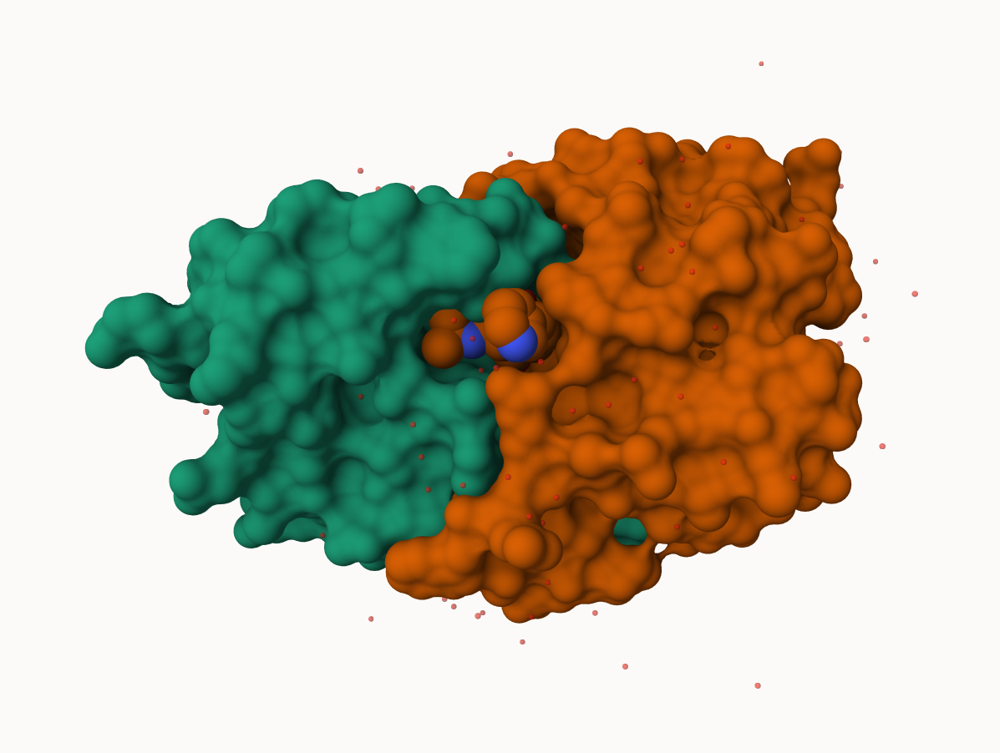
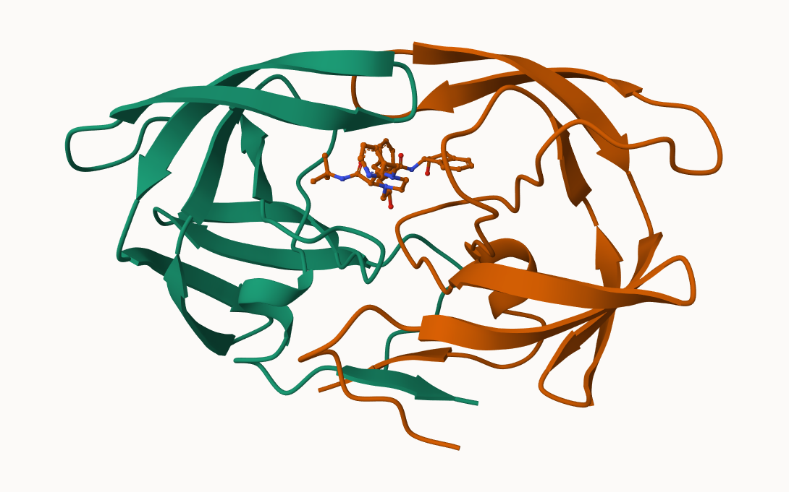
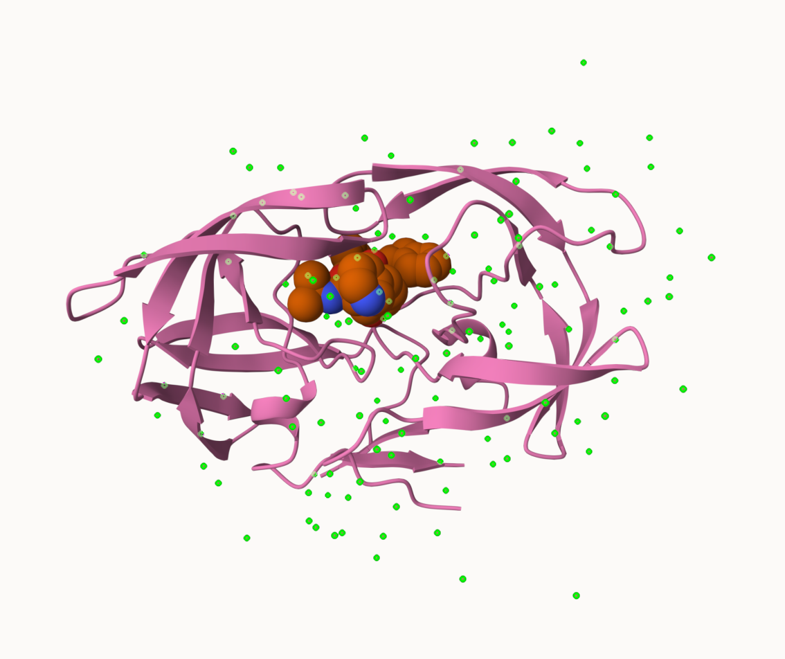

## The PDB database

The [Protein Data Bank (PDB)](http://www.rcsb.org/) is the main repository of biomolecular structure data. Let's see what's in it: 

```{r}
stats <- read.csv("pdbstats.csv", row.names = 1)
stats
```

```{r}
n.sums <- colSums(stats)
n.sums/n.sums["Total"]
round(n.sums,digits=2)
```


> Q1: What percentage of structures in the PDB are solved by X-Ray and Electron Microscopy.

```{r}
100 * n.sums[c("X.ray", "EM")] / n.sums["Total"]
```

> Q2: What proportion of structures in the PDB are protein?

```{r}
stats <- read.csv("pdbstats.csv", row.names = 1)
total_structures <- sum(stats$Total)
protein_rows <- grep("^Protein", rownames(stats))
protein_total <- sum(stats[protein_rows, "Total"])
protein_total / total_structures
```


>Q3: Type HIV in the PDB website search box on the home page and determine how many HIV-1 protease structures are in the current PDB?

The query matched 5 structures. 

>Q. What is the total number of entries? 

```{r}
n.sums["Total"]
```
## Using Molstar

We can use the main [Molstar viewer online](https://molstar.org/viewer/): 


> Q. Generate and insert an image of the HIV-Pr cartoon colored by secondary structure, showing the inhibitor (ligand) in ball and stick.



> Q. One final image showing catalytic APS 25 and all-important active site water molecule as spacefill. 




> Q4: Water molecules normally have 3 atoms. Why do we see just one atom per water molecule in this structure?

In PDB visualization h2o appears as a single atom. 

> Q5: There is a critical “conserved” water molecule in the binding site. Can you identify this water molecule? What residue number does this water molecule have? 

HOH 127

> Q6: Generate and save a figure clearly showing the two distinct chains of HIV-protease along with the ligand. You might also consider showing the catalytic residues ASP 25 in each chain and the critical water (we recommend “Ball & Stick” for these side-chains). Add this figure to your Quarto document. Discussion Topic: Can you think of a way in which indinavir, or even larger ligands and substrates, could enter the binding site?

HIV protease has flexible flaps covering the active site. These flaps can open temporarily, allowing substrates and inhibitors to slide into the catalytic pocket. Larger ligands may require flap displacement, which is why dynamics are important in inhibitor design.

> Q7: [Optional] As you have hopefully observed HIV protease is a homodimer (i.e. it is composed of two identical chains). With the aid of the graphic display can you identify secondary structure elements that are likely to only form in the dimer rather than the monomer?

HIV protease is a homodimer, so certain beta strands and loops form only at the dimer interface. Dimer only elements would not be stable in a monomer.

## Intro to Bio3d

```{r}
library(bio3d)

hiv <- read.pdb("1hsg")
hiv
```
```{r}
head(hiv$atom)
```
```{r}
pdbseq(hiv)
```

> Q7: How many amino acid residues are there in this pdb object? 

198

>Q8: Name one of the two non-protein residues? 

HOH and MK1

>Q9: How many protein chains are in this structure? 

2 chains, A and B

Let's try out the new **bio3dview** package that is not yet on CRAN.
We'll use the **remotes** package to install any R package from GitHub.

## Quick viewing of PDBs


```{r}
library(bio3dview)
sele <- atom.select(hiv, resno=25)
#view.pdb(hiv, backgroundColor ="pink", 
         #highlight=sele, 
        # highlight.style = "spacefill")
```
## Prediction of Protein flexibility 
```{r}
adk <- read.pdb("6s36")
m <- nma(adk)
plot(m)
```

Write out our results as a small trajectory movie: 

```{r}
mktrj(m, file="results.pdb")
```

```{r}
#view.nma(m, pdb=adk)
```
## Comparative protein structure analysis with PCA

We start with a database id "1ake_A"

```{r}
library(bio3d)

id <- "1ake_A"
aa <- get.seq(id)
```

```{r}
aa
```

```{r}
blast <- blast.pdb(aa)
```
Have a wee peek: 
```{r}
head(blast$hit.tbl)
```

```{r}
hits <- plot(blast)
```

Peak at our "top hits"
```{r}
head(hits$pdb.id)
```

Now we can download these "top hits" these will all be ADK structures in the PDB databse. 

```{r}
files <- get.pdb(hits$pdb.id, path="pdbs", split=TRUE,gzip=TRUE)
```

We need one package from BioConductor. To set this up we need to forst install a package called **BiocManager** from CRAN. 

Now we can use the `install()` function from this package like this:
`BiocManager::install("msa")`

```{r}
pdbs <- pdbaln(files, fit = TRUE, exefile="msa")
```

Let's have a wee peak at our. structures after "fitting" or superposing:

```{r}
library(bio3dview)
view.pdbs(pdbs, colorScheme = "residue")
```

We can run functions like `rmsd()`, `rmsf()`, and the best `pca()`
```{r}
pc.xray <- pca(pdbs)
plot(pc.xray)
```

```{r}
plot(pc.xray, 1:2)
```

Finally let's make a wee movie of the major "motion" or structural difference in the dataset - we call this a "trajectory"

```{r}
mktrj(pc.xray, file="results.pdb")
```

